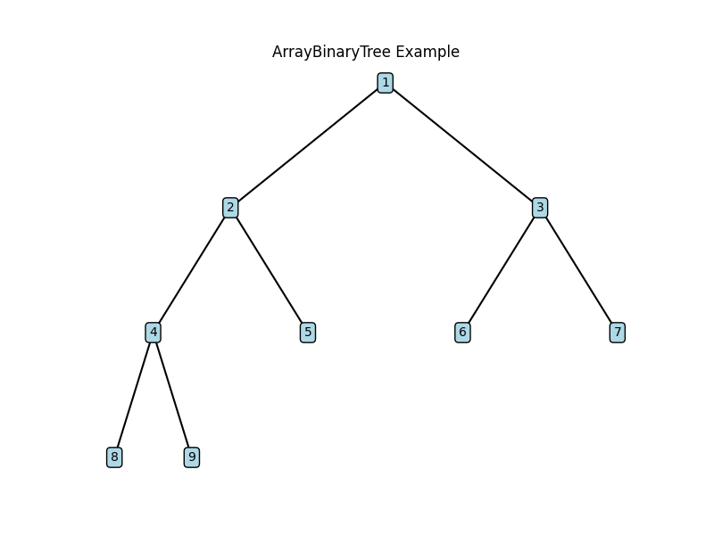
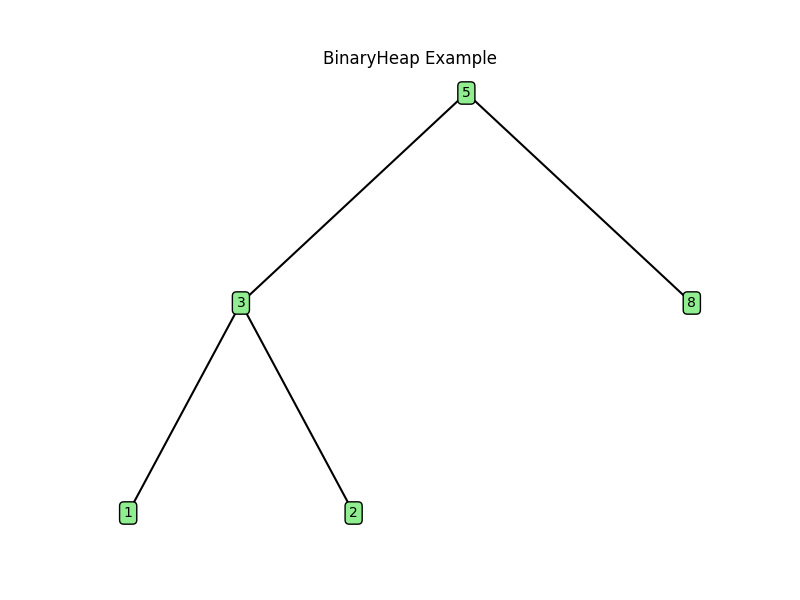

# SoftwareMechatronics

An educational Python collection of data structures, algorithms, and computation models, with examples and diagrams. Version 0.1.0 is under development.

## Implemented features

- Data structures: arrays, linked lists, stacks, queues, hash tables, binary trees, array binary trees, AVL trees, graphs, and union-find.
- Searching and sorting: binary search, BFS, DFS, merge sort, and quick sort.
- Graph algorithms: Dijkstra, Bellman-Ford, A*, Floyd-Warshall, Prim, Kruskal, Edmonds-Karp max flow, and topological sort.
- Dynamic programming: knapsack, edit distance, LIS, and a Held-Karp TSP example.
- Backtracking and optimization: N-Queens, Sudoku, and simulated annealing for TSP.
- String matching: KMP.
- Computation models: FSM, PDA, Turing machine, lambda calculus, and SKI combinators.
- Utilities and composites: memoization, bitmask helpers, timing, binary heaps, line sweep, and brute-force raster Voronoi visualization.

Implementation does not imply complete validation. See the limitations below and the [status report](docs/diagrams/audit_reports/audit_report.md).

## Installation

Python 3.8 or newer is declared supported; the cleanup checks were run on Python 3.9.

```bash
git clone https://github.com/JENkt4k/softwareMechatronics.git
cd softwareMechatronics
python -m pip install -e .
```

The core library uses the standard library. Install optional dependencies for plotting and raster Voronoi:

```bash
python -m pip install -e ".[visuals]"
```

For the SciPy comparison demo, use `python -m pip install -e ".[reference]"` instead. These extras also supply NumPy for the expanded benchmark script.

`SoftwareMechatronics` is the distribution name. Python imports use the top-level packages shown below.

## Usage

```python
from algorithms.graph.dijkstra import dijkstra

graph = {
    "A": {"B": 1, "C": 4},
    "B": {"A": 1, "C": 2, "D": 5},
    "C": {"A": 4, "B": 2, "D": 1},
    "D": {"B": 5, "C": 1},
}
print(dijkstra(graph, "A"))
```

Run examples as modules:

```bash
python -m examples.dijkstra_vs_bellman
python -m examples.held_karp_tsp
python -m examples.heap_demo
```

With the visuals extra installed:

```bash
python -m examples.array_binary_tree_visual_demo
python -m examples.heap_visual_demo
python -m composites.geometry.fortune_voronoi_demo
```

The last command visualizes **brute-force** raster Voronoi regions, independently of the experimental Fortune implementation.

## Testing

From the repository root:

```bash
python -m unittest discover -s tests -v
```

All maintained unit tests live directly in `tests/`, including AVL invariants and line-sweep tests. Passing tests cover selected cases, not every algorithm or edge case.

## Experimental features and known limitations

**Fortune's Voronoi algorithm is an unfinished sketch.** Constructing `FortuneVoronoi` emits a `RuntimeWarning`. It processes site events but returns an empty edge list; circle-event handling, exact beachline breakpoints, edge generation, and bounding-box clipping remain unfinished. Its animations illustrate work in progress and are not computed Voronoi diagrams. `fortune_voronoi_2` is a compatibility alias to the same sketch. Bounding boxes use `(xmin, ymin, xmax, ymax)`.

Other known correctness gaps, deferred from this cleanup:

- The PDA's balanced-parentheses example does not reliably recognize balanced input; epsilon transitions and stack/acceptance behavior need review.
- Lambda substitution is not capture-avoiding.
- Line sweep can miss shared-endpoint intersections because end events sort before start events at the same x-coordinate.

These modules should not be treated as fully validated general-purpose implementations.

## Project structure

- `algorithms/`: searching, sorting, graph, DP, backtracking, string, and optimization algorithms.
- `data_structures/`: foundational structures.
- `composites/`: heaps and geometry compositions.
- `computation_models/`: interpreters and automata.
- `utils/`: memoization, bitmasking, and benchmarks.
- `examples/`: runnable demonstrations.
- `tests/`: unit tests, excluded from the installed distribution.
- `docs/diagrams/`: diagrams, benchmark notes, and the status report.




## License

Earlier documentation stated MIT, but this repository does not currently include a license file. A license file must be added by the project owner before the licensing status is considered resolved.
