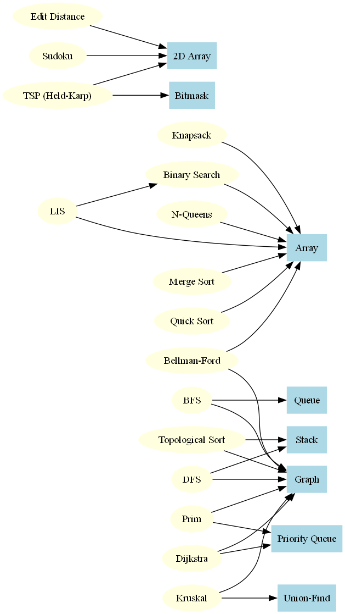

# Algorithm-to-Data-Structure Dependency Graph

This diagram visualizes the relationships between algorithms and the data structures they rely on.

## Overview

- **Blue boxes** represent **core data structures**.
- **Yellow ellipses** represent **algorithms**.
- **Directed arrows** indicate **which data structure an algorithm uses**.

## Included Relationships

- **Sorting & Searching:**
  - Binary Search → Array
  - Merge Sort → Array
  - Quick Sort → Array

- **Graph Traversals:**
  - BFS → Graph, Queue
  - DFS → Graph, Stack

- **Shortest Paths:**
  - Dijkstra → Graph, Priority Queue
  - Bellman-Ford → Graph, Array

- **Minimum Spanning Trees:**
  - Prim → Graph, Priority Queue
  - Kruskal → Graph, Union-Find

- **Other:**
  - Topological Sort → Graph, Stack
  - Knapsack → Array
  - Edit Distance → 2D Array
  - LIS → Array, Binary Search
  - N-Queens → Array
  - Sudoku → 2D Array
  - TSP (Held-Karp) → 2D Array, Bitmask

## Graph

The visual graph is located here:
